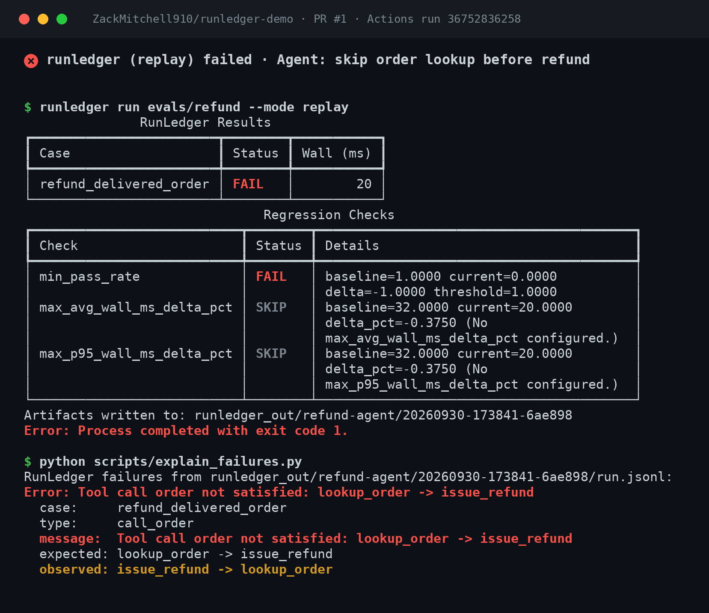

# runledger-demo: an agent PR that fails CI for calling tools in the wrong order

[](https://github.com/ZackMitchell910/runledger-demo/actions/workflows/runledger.yml)

A tiny, real, reproducible demo of [RunLedger](https://github.com/runledger/Runledger), an open-source CI harness for tool-using AI agents, blocking a pull request.

**The failing PR:** [#1: Agent: skip order lookup before refund](https://github.com/ZackMitchell910/runledger-demo/pull/1)



## The 60-second version

- `evals/refund/agent/agent.py` is a small refund/support agent. It has two tools: `lookup_order` and `issue_refund`.
- Rule: **never refund an order you haven't looked up.** The agent has to confirm the order exists, is refundable, and what was actually charged *before* it moves money.
- `evals/refund/suite.yaml` puts that rule in code:
  ```yaml
  assertions:
    - type: json_schema          # output contract
      schema_path: schema.json
    - type: must_call
      tools: ["lookup_order", "issue_refund"]
    - type: call_order           # tool-order contract
      order: ["lookup_order", "issue_refund"]
  budgets:
    max_tool_calls: 2            # tool-call budget
    max_tool_errors: 0
  ```
- Tool results are **recorded once** into a cassette (`evals/refund/cassettes/*.jsonl`) and **replayed in CI**. No LLM or API keys, no network calls to tools. Every run is deterministic.
- `.github/workflows/runledger.yml` installs `runledger==0.2.0` from PyPI and runs the suite on every push and pull request.
- `main` is green. PR #1 "optimizes" the agent to refund on the customer's claimed amount first and look the order up afterward. Both calls still happen and both replay fine from the cassette. The **order** is wrong, so RunLedger fails the check:

```
Tool call order not satisfied: lookup_order -> issue_refund
  expected: lookup_order -> issue_refund
  observed: issue_refund -> lookup_order
```

The gates RunLedger v0.2.0 enforces here are tool order (`call_order`, `must_call`, `must_not_call`), output schema (`json_schema`), and tool-call budgets (`max_tool_calls`, `max_tool_errors`), plus wall time and baseline pass rate. It does **not** enforce token or cost budgets.

## Run it locally

```bash
git clone https://github.com/ZackMitchell910/runledger-demo
cd runledger-demo
python -m pip install runledger==0.2.0

# main: passes (exit 0)
runledger run evals/refund --mode replay

# the PR branch: fails (exit 1) on the tool-order contract
git fetch origin pull/1/head:skip-lookup && git checkout skip-lookup
runledger run evals/refund --mode replay; echo "exit=$?"
python scripts/explain_failures.py   # prints the failure reason from runledger_out/**/run.jsonl
```

Artifacts (`report.html`, `summary.json`, `junit.xml`, `run.jsonl`) land in `runledger_out/<suite>/<run_id>/`. CI uploads them as the `runledger-artifacts` artifact.

`runledger run` prints a PASS/FAIL table and exits non-zero. The failure *reason* is written to the artifacts (`summary.json` → `failure_reason`, `run.jsonl` → `assertion_failure`). `scripts/explain_failures.py` just echoes those events into the CI log. It does not add any checks of its own.

### Re-recording the cassette

`evals/refund/demo_tools.py` is a fake order backend, used only when recording:

```bash
cd evals/refund
rm cassettes/refund_delivered_order.jsonl
PYTHONPATH=. runledger run . --mode record
```

## Layout

```
evals/refund/
  agent/agent.py        # agent under test (stdio JSON protocol)
  suite.yaml            # tools, assertions, budgets
  schema.json           # output JSON Schema
  cases/*.yaml          # test cases
  cassettes/*.jsonl     # recorded tool results (replayed in CI)
  demo_tools.py         # fake backend for recording only
baselines/refund-agent.json   # baseline from a known-good run
scripts/explain_failures.py   # prints failure reasons from RunLedger artifacts
.github/workflows/runledger.yml
```

## Links

- RunLedger (MIT): https://github.com/runledger/Runledger · `pip install runledger`
- Website: https://runledger.io
- Want this wired into your agent repo? **$299 CI Setup**: https://runledger.io/pricing

License: MIT
